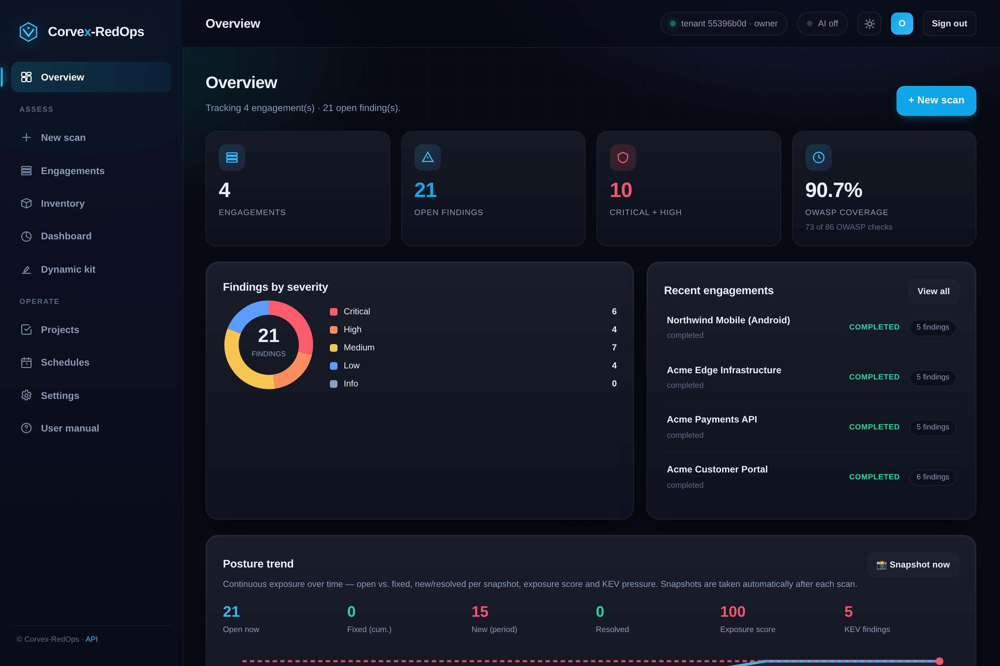
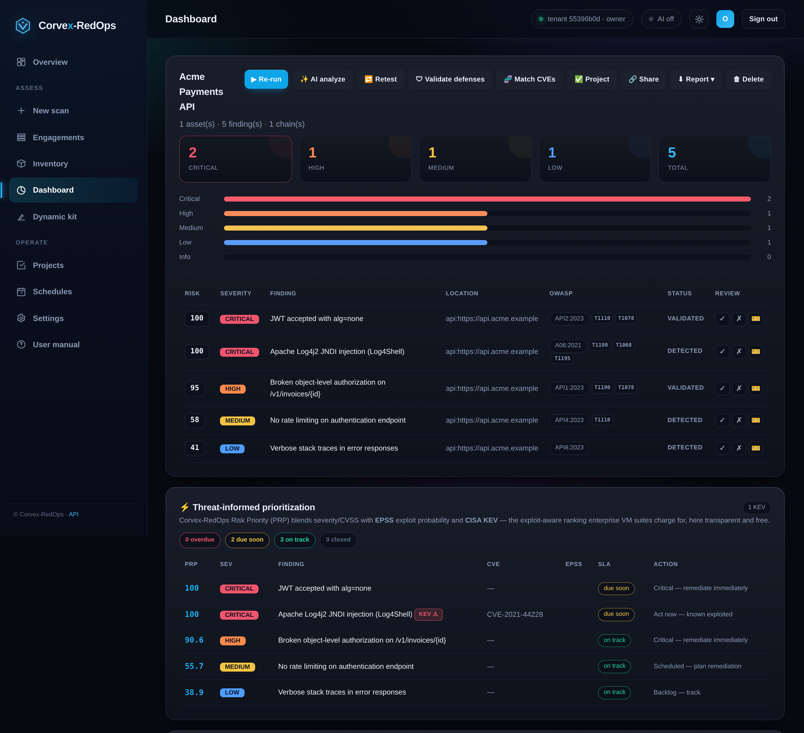
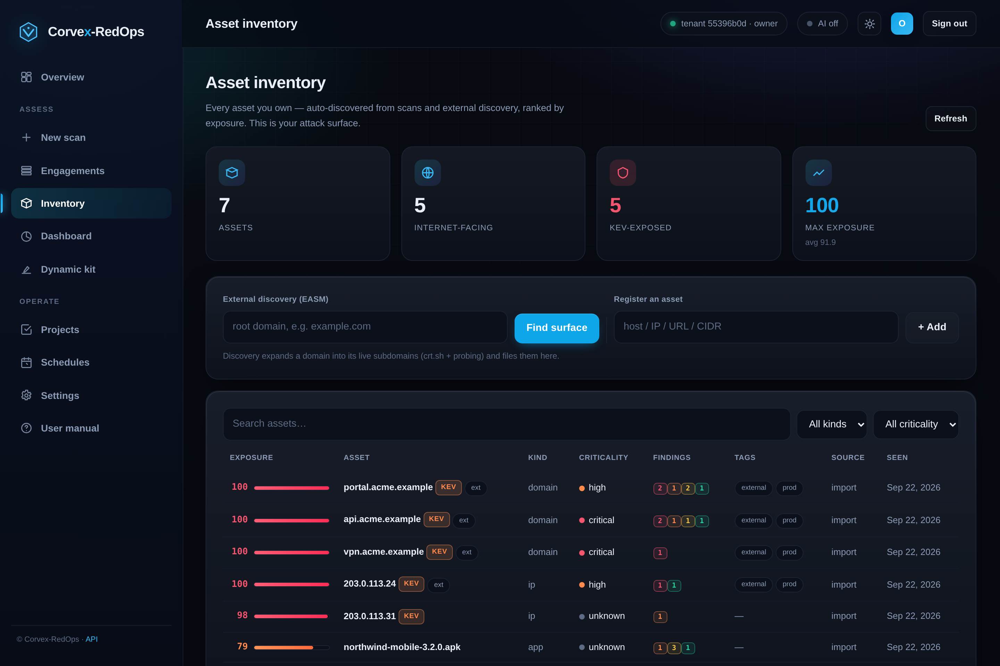
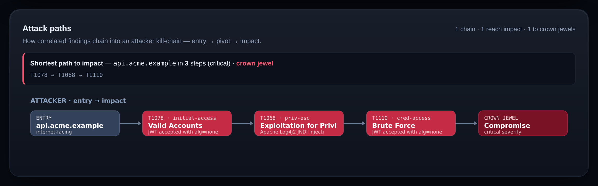
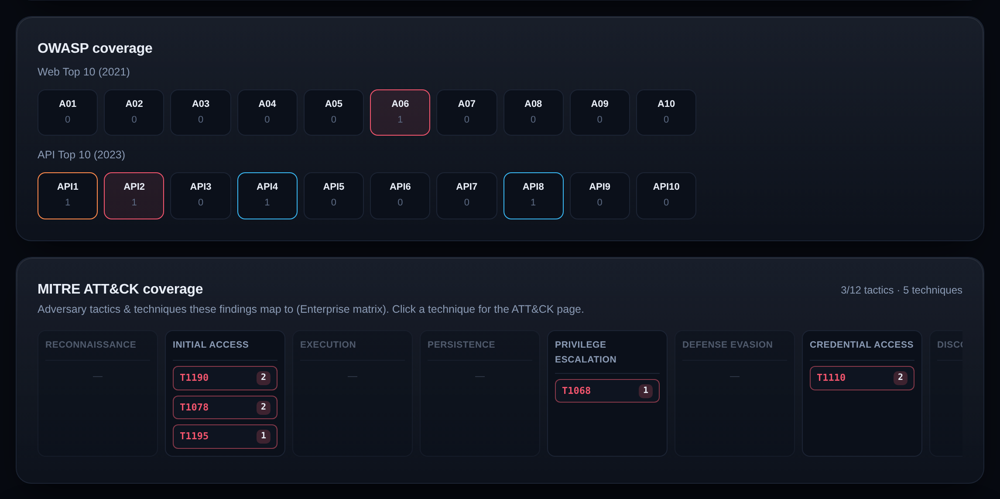
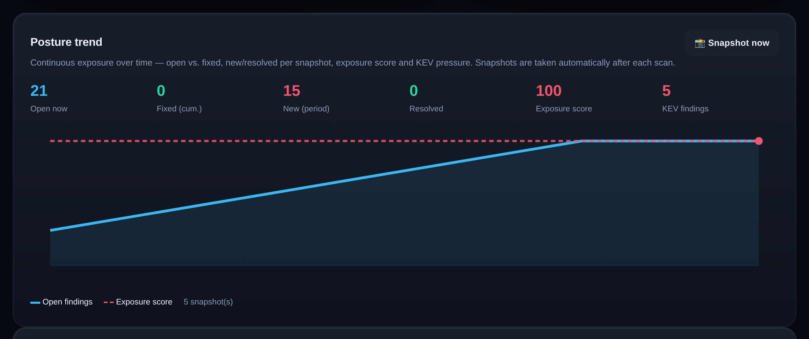
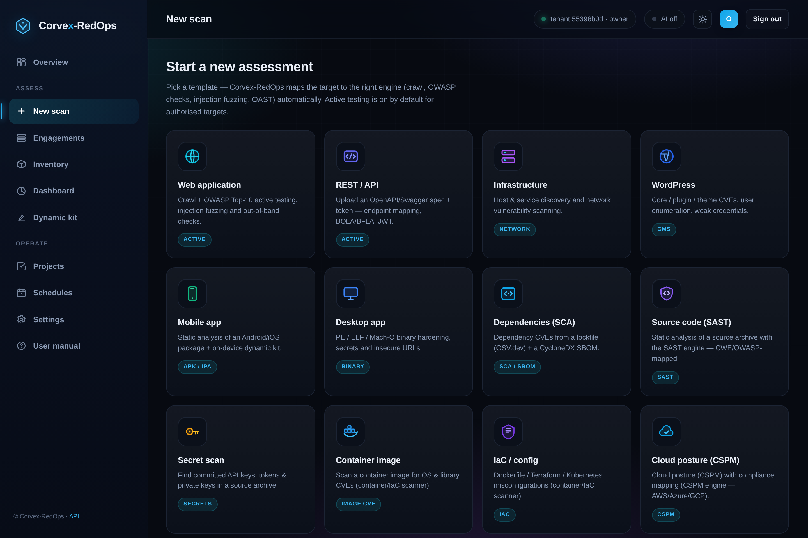
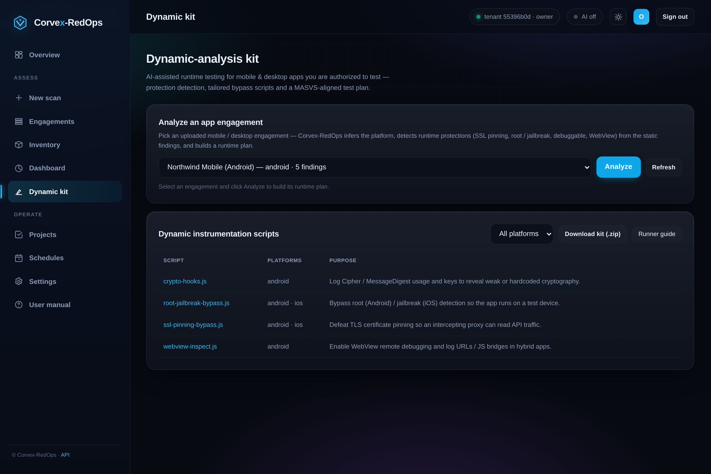
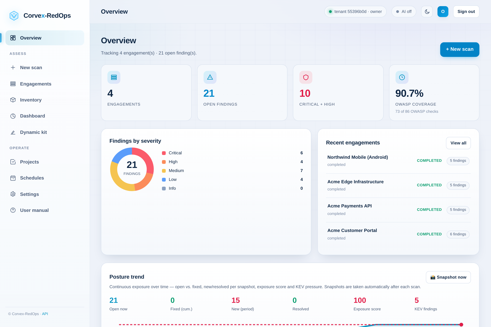

<div align="center">

# 🛡️ Corvex-RedOps

### One platform for Vulnerability Assessment **and** Penetration Testing — every asset, one engine, client-ready in minutes.

*Web · API · Mobile · Desktop · Infrastructure · Network devices · Firewalls · Hardening · WordPress · Active Directory · Code · Containers · Cloud — discovered, actively tested, **safely validated**, threat-prioritized, correlated, and reported. Self-hosted. AI-assisted. Zero licensing cost.*

<br/>


<br/>


[Why Corvex-RedOps](#-why-corvex-redops) · [vs Commercial Tools](#-how-corvex-redops-compares) · [Features](#-features) · [Screens](#-screens--samples) · [Install](#-installation) · [Quick Start](#-quick-start) · [API](#-rest-api-reference)

<br/>



</div>

---

> **Replaces two product categories with one.** Enterprise vulnerability-management suites *find* but don't exploit; exploitation frameworks *exploit* but don't do continuous assessment, prioritization or reporting. Corvex-RedOps does **both** — and adds transparent, exploit-aware prioritization (EPSS + CISA KEV) that the enterprise tools charge for and keep opaque. See the full [**comparison →**](docs/COMPETITIVE.md)

---

> ⚠️ **Authorized use only.** Corvex-RedOps performs active security testing, including safe, non-destructive exploit validation. Use it **only** against systems you own or are explicitly authorized to test. Scope enforcement, a safe-mode governor, and a full audit trail are **core, built-in features**. See [Legal & Ethics](docs/LEGAL_AND_ETHICS.md).

---

## 📖 Table of Contents

- [What is Corvex-RedOps?](#-what-is-corvex-redops)
- [Why Corvex-RedOps](#-why-corvex-redops)
- [How Corvex-RedOps compares](#-how-corvex-redops-compares)
- [Features](#-features)
- [Threat-informed prioritization](#-threat-informed-prioritization)
- [Asset Coverage](#-asset-coverage)
- [Attack-surface crawler](#-attack-surface-crawler)
- [Proxy-history import](#-proxy-history-import)
- [Out-of-band detection (OAST)](#-out-of-band-detection-oast)
- [Native OWASP active checks](#-native-owasp-active-checks-vapt-depth)
- [OWASP coverage checklist](#-owasp-coverage-checklist)
- [AI layer (self-hosted)](#-ai-layer-optional-self-hosted)
- [How It Works](#-how-it-works)
- [Screens & Samples](#-screens--samples)
- [Installation](#-installation)
- [Quick Start](#-quick-start)
- [Deployment](#-deployment)
- [User Manual](#-user-manual)
  - [1. Scope files](#1-scope-files)
  - [2. CLI reference](#2-cli-reference)
  - [3. Scanning each asset type](#3-scanning-each-asset-type)
  - [4. Uploading apps & configs](#4-uploading-apps--configs)
  - [5. Reports](#5-reports)
  - [6. Continuous scanning & scheduling](#6-continuous-scanning--scheduling)
  - [7. Authentication, tenants & RBAC](#7-authentication-tenants--rbac)
  - [8. Configuration](#8-configuration)
- [REST API Reference](#-rest-api-reference)
- [Safety, Authorization & Legal](#-safety-authorization--legal)
- [Development & Testing](#-development--testing)
- [Roadmap](#-roadmap)
- [Contributing](#-contributing)
- [License](#-license)

---

## 🔍 What is Corvex-RedOps?

Security teams run VAPT with a sprawl of disconnected point tools — each with its own output format and no shared model. The result is hours of glue work, false-positive overload, inconsistent methodology, and reporting that takes as long as the testing.

**Corvex-RedOps unifies the entire VAPT lifecycle into one workflow-driven platform.** It orchestrates best-in-class tools behind a single engine, normalizes their output into one findings model, **safely validates** whether findings are actually exploitable, prioritizes by risk, correlates issues into attack chains, and produces **client-ready reports** — HTML, Markdown, PDF, or DOCX, with compliance mapping and white-label branding.

It does **both halves** of the job:

- **Vulnerability Assessment (VA)** — discover, enumerate, and prioritize weaknesses across the full asset surface.
- **Penetration Testing (PT)** — safely confirm real exploitability (non-destructively), cutting false positives and proving impact.

It ships as **both** a free, self-hostable open-source engine **and** a multi-tenant SaaS platform (REST API + web console + scheduling + reporting).

---

## 💡 Why Corvex-RedOps

| | The problem with the status quo | What Corvex-RedOps does |
|---|---|---|
| **Two silos, two invoices** | VM tools scan; PT tools exploit. You buy and stitch together both. | **One platform** does assessment *and* safe exploit validation. |
| **Opaque, paywalled prioritization** | Enterprise VM suites' proprietary risk scores are black boxes on premium tiers. | **Transparent PRP** — CVSS × EPSS × CISA KEV, every factor shown, free & offline. |
| **Cloud lock-in** | Enterprise cloud tiers are cloud-tethered — a non-starter when air-gapped. | **Fully self-hosted & air-gappable.** Your data never leaves your lab. |
| **Narrow coverage** | Web proxies are web-only; VM scanners are thin on web/mobile. | **10 asset classes** in one engine, incl. an AI-assisted mobile runtime kit. |
| **Bolt-on, cloud AI** | AI features are per-seat cloud upsells. | **Local, private AI** for correlation, FP-reduction & a copilot. |
| **$$$$ licensing** | Enterprise suites run five to six figures a year. | **Apache-2.0, $0 licensing.** Open-core. |

## 🥊 How Corvex-RedOps compares

| Capability | Corvex-RedOps | Enterprise VM suites | Web proxies | Exploitation frameworks |
|---|:--:|:--:|:--:|:--:|
| Licensing cost | **Free** | 💰💰💰 | 💰💰💰 | 💰💰–💰💰💰💰 |
| Self-hosted / air-gap | ✅ | ✅¹ | ✅ | ✅ |
| VA + safe exploit validation | ✅ | ❌ / 🟡 | ❌ | ✅ |
| Web · API · Mobile · Desktop · Infra · AD | ✅ | 🟡 | web only | 🟡 |
| Exploit-aware prioritization (EPSS + KEV) | ✅ transparent | 💰 opaque | ❌ | ❌ |
| Remediation SLA tracking | ✅ | ✅ | ❌ | ❌ |
| Local, private AI | ✅ | 🟡 cloud | ❌ | ❌ |
| Client-ready reports (exec + technical) | ✅ | ✅ | 🟡 | ✅ |

<sub>✅ full · 🟡 partial / add-on / roadmap · ❌ none · 💰 paid tier. ¹ Some enterprise VM suites ship fully on-prem editions; their cloud tiers are not air-gappable. Full breakdown, category-by-category analysis and **honest gaps** (independent-benchmark results, single-maintainer status, Postgres/worker roadmap) in **[docs/COMPETITIVE.md](docs/COMPETITIVE.md)**.</sub>

---

## ✨ Features

### Core engine
- **One normalized findings model** across every tool and asset type — deduplicate, correlate, and risk-score once.
- **10 asset modules** covering the complete attack surface (see [Asset Coverage](#-asset-coverage)).
- **Proxy-history XML import** — turn a captured proxy/history export into a ready-to-run engagement: every captured endpoint, parameter and bearer-token identity is extracted and fed straight to the active engine (a 90 MB history parses in ~1s).
- **Safe exploit validation** — non-destructive reflected-XSS and boolean-based SQLi confirmation that flips findings from *detected* to *validated* (with evidence) or dismisses false positives.
- **Risk scoring (0–100)** blending severity, CVSS, confidence, and validation state.
- **Threat-informed prioritization — Corvex-RedOps Risk Priority (PRP)** — blends CVSS with **FIRST EPSS** (exploit probability) and **CISA KEV** (known-exploited, incl. ransomware) into one transparent 0–100 score, with the SLA state for every finding. This is the exploit-aware ranking enterprise VM suites charge for and keep opaque behind proprietary scores — here **explainable, free, and offline-capable** (bundled KEV seed; live refresh from CISA/FIRST). See [`pentestiq/intel/`](pentestiq/intel/).
- **Remediation SLA tracking** — per-severity windows (Critical 7d / High 30d / Medium 90d …), due dates, overdue flags and MTTR — matching the remediation-project workflows of enterprise VM suites.
- **Attack-chain correlation** — links findings that share a host + service into one story.
- **Optional local-AI layer (self-hosted, zero budget)** — a local open-source model via **a local AI runtime** powers analyst-grade write-ups, **attack-chain correlation**, a **false-positive verifier**, and an in-console **copilot**; plus a **self-learning** confidence model that improves from analyst confirm/dismiss feedback. Fully optional and fail-safe: with no model present, Corvex-RedOps runs exactly as before on its deterministic engine.

### Attack surface & continuous exposure (CTEM)
- **Asset inventory** — one tenant-wide registry of everything you own (domains, IPs, CIDRs, apps, cloud resources), de-duplicated across every scan and import, with business criticality, owner and tags. Every finding rolls up to its asset.
- **External discovery (EASM)** — give it a root domain and it expands the external surface from certificate-transparency logs and passive sources, resolves each host, fingerprints the live ones and files them in the inventory.
- **Exposure scoring** — a per-asset 0–100 score from internet exposure × business criticality × open findings × CISA KEV, so the inventory is ranked by real risk.
- **Posture trends & alerts** — a snapshot after every scan (open vs. fixed, new vs. resolved, MTTR, exposure, KEV pressure), plus a webhook alert when a new KEV or critical lands on an internet-facing asset.

### Code, containers & cloud
- **SCA + SBOM** — dependency CVEs from lockfiles and manifests via OSV.dev, with a CycloneDX 1.5 SBOM export.
- **SAST & secret scanning** — source findings mapped to CWE/OWASP; committed credentials detected and **redacted** so a report never re-exposes them.
- **Container image & IaC** — image CVEs and Dockerfile / Terraform / Kubernetes misconfigurations; a Kubernetes CIS benchmark.
- **Cloud posture (CSPM)** — read-only AWS / Azure / GCP posture checks mapped to CIS, PCI-DSS, NIST and SOC 2, using the host's own credentials.
- **Bring your own scanner** — import vulnerability-scanner XML, template-scanner JSONL, container-scanner JSON, DAST JSON, SARIF or generic JSON; findings are normalized, de-duplicated and prioritized with everything else. SARIF export for code-scanning pipelines.

### Adversary view
- **MITRE ATT&CK mapping** — every finding tagged with techniques, and an ATT&CK coverage matrix per engagement.
- **Attack-path graph** — correlated findings chained entry → pivot → impact, with the shortest path to a crown-jewel asset.
- **Control validation (BAS-lite)** — opt-in, benign technique checks that report whether your defenses actually fire. Refuses to run without explicit authorization.

### Remediation workflow (PTaaS)
- **Retest & diff** — re-run an engagement and every finding is marked new, persisting or fixed, with MTTR.
- **Remediation projects** — group findings into owned, dated work that closes itself when its findings are fixed.
- **Ticketing** — push findings to Jira, ServiceNow, Slack or any webhook.
- **Client portal** — a tokenized, expiring, read-only link to an engagement's findings and reports. No login, no write access.
- **Authenticated scanning** — credentialed SSH / WinRM / HTTP-auth checks from an encrypted credential vault (scrypt + Fernet); secrets are never returned by the API.

### Safety & governance (built in, not bolted on)
- **Scope enforcement** — every engagement runs against a validated scope; out-of-scope targets are blocked (or warned) by policy.
- **Safe-mode governor** — non-destructive by default; intrusive/exploit actions require explicit, logged opt-in.
- **Append-only audit trail** (JSONL) — who ran what, against what, when, and what the policy decided.
- **Per-host rate limiting** — never accidentally DoS a target.

### Platform (SaaS layer)
- **REST API** (FastAPI) with auto-generated OpenAPI docs at `/docs`.
- **Web console** — create engagements, upload apps/configs, run scans, watch findings, open reports — served at `/`.
- **Authentication, multi-tenancy & RBAC** — user login (PBKDF2), session tokens, per-tenant API keys (hashed), and roles (`viewer` → `member` → `admin` → `owner`).
- **Continuous scanning** — recurring schedules with **diffing** (new / fixed / persisting) and **Slack/webhook notifications**.
- **Two report types, four formats** — a **Full Technical Report** (cover page, executive summary, scope, CVSS risk methodology, findings summary, per-finding detail with issue/impact/evidence/PoC/CVSS-vector/CWE/remediation, remediation roadmap, conclusion and OWASP appendices) and a management-facing **Executive Summary** (risk-posture gauge, severity donut, OWASP bar chart, top risks, attack chains, remediation priorities). Both export to **HTML / PDF / DOCX** (full report also Markdown), print-ready with running headers and page numbers, **compliance mapping** (OWASP / PCI-DSS / ISO 27001 / MITRE ATT&CK), and **per-tenant white-label branding**.

### Deployment
- **Self-hostable** — `pip install` for the engine; **Docker Compose** for the full stack with the integrated mobile-analysis service. The image bundles the orchestrated scanning engines (port & service discovery, a headless browser for SPA crawling, and template-based scanning) so a container deploy has full capability out of the box.
- **Postgres-ready** — SQLite by default, swappable behind clean storage interfaces.

---

## 🎯 Asset Coverage

Ten modules — the complete VAPT surface, driven by Corvex-RedOps's own engines with additional deep-scan backends bundled in the platform (auto-detected; anything unavailable is skipped, never fatal).

| # | Module | Asset type | What Corvex-RedOps does |
|---|---|---|---|
| 1 | `infra` | Infrastructure / network | Host & service discovery, port enumeration, network vulnerability scanning |
| 2 | `web` | Web applications | Crawl (static + headless SPA), OWASP Top-10 active checks (headers/CORS/JWT/authz/errors/CSRF/outdated-JS), injection fuzzing (SQLi/NoSQLi/XSS/XXE/CRLF/open-redirect/SSTI/traversal/cmd-i), out-of-band detection, safe exploit validation |
| 3 | `wordpress` | WordPress sites | **Native checks** (fingerprint/version, user enumeration, XML-RPC exposure, exposed config/backup/debug files, directory listing) with **no external tools**; the WordPress scanning engine's CVE data + the template-based scanning engine layer on when installed |
| 4 | `api` | REST / OpenAPI | Endpoint mapping + **authenticated access-control (BOLA/IDOR), token analysis, tenant confusion, excessive-data-exposure** (OWASP API Top 10) |
| 5 | `mobile` | Mobile apps (Android / iOS) | Static analysis of code, manifest, permissions, secrets & certificates (CWE/MASVS) + on-device dynamic kit |
| 6 | `desktop` | Desktop binaries (PE / ELF / Mach-O) | Hardcoded secrets/keys, insecure URLs, missing binary hardening (NX/PIE/RELRO/canary/DEP/CFG) |
| 7 | `network-device` | Routers / switches | Device config audit: telnet, default/RW SNMP, weak passwords, cleartext management |
| 8 | `firewall` | Firewall rulesets | Configuration-auditor-grade ruleset audit: any-any permits, exposed services, shadowed rules |
| 9 | `hardening` | System hardening | Host hardening gaps (SSH/kernel/CIS) + hardening-report ingestion |
| 10 | `active-directory` | Active Directory / domain | Domain security-posture review from a policy export: password policy, Kerberos (AS-REP roasting / Kerberoasting), unconstrained delegation, GPP cpassword, SMBv1/LLMNR, machine-account quota, privileged-group sprawl |

Beyond the ten asset modules, eight more engines cover code, containers, cloud and the external surface:

| Engine | Input | What Corvex-RedOps does |
|---|---|---|
| External discovery | A root domain | Certificate-transparency + passive subdomain sources, DNS resolution and live-host fingerprinting, filed into the inventory |
| Dependencies (SCA) | Lockfile / manifest | Dependency CVEs via OSV.dev + CycloneDX 1.5 SBOM |
| Source code (SAST) | Source archive | Code findings mapped to CWE / OWASP |
| Secret scan | Source archive | Committed keys, tokens and private keys — redacted in every output |
| Container image | Image reference | OS and library CVEs in the image |
| IaC / config | Dockerfile / Terraform / Kubernetes | Misconfigurations, plus a Kubernetes CIS benchmark |
| Cloud posture (CSPM) | Cloud account (read-only) | Posture failures mapped to CIS, PCI-DSS, NIST and SOC 2 |
| Scan import | Third-party scanner output | Normalized, de-duplicated and prioritized with native findings |

Plus **lab automation** — `lab/docker-compose.yml` stands up intentionally-vulnerable targets for testing and demos.

---

## 🕷️ Attack-surface crawler

Corvex-RedOps ships a native, dependency-free **crawler** (`pentestiq.crawler`) that
discovers the app surface — like the commercial DAST engines — so the checks run
across the whole application instead of only the endpoints you supply:

- **BFS crawl**, same-scope (optional subdomains), depth- and page-bounded, rate-limited.
- Extracts **links, forms (action/method/inputs), query parameters**, and
  **endpoints mined from JavaScript bundles** (the recon that surfaced internal
  endpoints in a real SaaS assessment).
- **Templatizes id paths** (`/user/42` → `/user/{id}`) → automatic **BOLA/IDOR**
  candidates; GET paths become **data-exposure** targets.
- **Headless-browser SPA mode** (optional): renders JavaScript, follows
  client-side routes, and captures the **XHR/fetch API endpoints** a SPA only creates
  at runtime — the surface a static crawler can't see. Enabled with `--spa` (or
  `asset.metadata.spa_crawl = true`); falls back to the static crawl if the headless
  browser isn't installed (a missing component never breaks a run).
- Runs in the `web` module's discovery phase and feeds the check engine
  automatically; also available standalone: `corvex crawl https://app.example.com --token <jwt> --spa`.

## 🐙 Proxy-history import

Already proxied the target through an intercepting proxy? Import that history and skip the crawl —
Corvex-RedOps turns a **"Save items" / proxy-history XML** export into a
ready-to-run engagement:

- **Streams** the export (scales to large multi-hundred-MB histories), filtering
  to the **in-scope host(s)** you name — analytics/telemetry/CDN noise is dropped
  automatically (or auto-detects the busiest first-party host).
- Decodes each request and extracts the **endpoints, query & body parameters**,
  templatized **BOLA/IDOR** candidates, and every **bearer token** seen in an
  `Authorization` header — which become test **identities** for access-control
  testing, no manual token wrangling.
- Hands that exact surface to the native engine, so BOLA, injection, JWT and
  data-exposure checks run against the endpoints and parameters you actually
  captured — the surface a fresh crawl of a SPA would miss.

Upload it from the console (**New scan → Upload → Proxy history**, with an optional
scope-hosts field), or wire it into automation via the upload API
(`asset_type=burp`). Everything runs under `allow_active`, on by default for
authorized targets.

## 📡 Out-of-band detection (OAST)

For **blind** vulnerabilities — where the only signal is the target's own server
reaching back to infrastructure you control — Corvex-RedOps ships a native,
self-hostable **OAST collaborator** (the out-of-band interaction service model):

- **`corvex oast-server --port 9099 [--dns-port 53 --domain oast.example.com]`**
  stands up a collaborator. HTTP mode records interactions by token from a Host
  sub-domain (`<token>.oast.example.com`, needs wildcard DNS) or a path
  (`http://<ip>:<port>/<token>`, needs only a public IP). The optional **DNS catcher**
  (`--dns-port`) answers `A` records for `<token>.<domain>` and logs the lookup — so
  it confirms blind interactions that only do a **DNS resolution** even when outbound
  HTTP is filtered (delegate the domain's NS to the collaborator's IP).
- OAST-enabled checks inject a unique collaborator URL/host and confirm the bug
  **only** if the callback lands — a hit is high-confidence proof, not a guess:
  - **Blind SSRF** — injected into discovered/likely URL params and SSRF-prone
    headers (`A10` / API7).
  - **Stored / blind XSS** — script payloads planted in forms; confirmed if a
    browser later renders them and loads the collaborator (deferred capture).
- Point the checks at a collaborator via `asset.metadata.oast = {"url": "http://collab:9099"}`
  (or `{"domain": "oast.example.com"}`); OAST checks are gated behind `allow_active`.

Verified end-to-end in `bench/`: the benchmark stands up a collaborator and
**confirms blind SSRF out-of-band** as one of **25/25 planted vulnerabilities**
detected across the crawl → checks → OAST → fuzz pipeline.

> **What this proves — and what it doesn't.** `bench/` is a *self-authored* lab: it
> demonstrates the pipeline wires up end-to-end (crawl → detect → validate → report),
> not that detection is competitive against arbitrary targets. Results on an
> independent corpus (OWASP Benchmark, WAVSEP, public CTF sets) are on the roadmap and
> are the honest bar for comparison. Treat the 25/25 as an integration test, not a detection score.

## 🧪 Native OWASP active checks (VAPT depth)

Generic scanners find *technical* web bugs; a real VAPT of a modern multi-tenant
SaaS is ~70% **authorization, JWT, and business-logic** testing that needs
authenticated, multi-identity, active probing. Corvex-RedOps ships a native,
dependency-free checks engine (`pentestiq.checks`) that provides exactly that —
run in the `web` and `api` `assess()` phase, feeding the same dedup / risk-scoring
/ reporting pipeline.

| Check | Finds | OWASP |
|---|---|---|
| **JWT security** | `alg:none`, offline HMAC weak-secret crack, embedded secondary tokens / all-perms claims, long TTL, live none-alg accept probe | API2 / A02 |
| **BOLA / IDOR** | cross-identity object reads (two-identity diff) | API1 |
| **Tenant confusion** | query param overrides token tenant scope | API1 |
| **Excessive data exposure** | password hashes / secrets / tokens in responses | API3 |
| **Account enumeration** | valid-vs-invalid user response diff | A07 |
| **Login rate-limit** *(gated)* | missing lockout / 429 on failed logins | A07 |
| **Security headers / clickjacking / cookies** | HSTS, CSP, `frame-ancestors:*`, XFO, cookie flags | A05 |
| **CORS** | origin reflection with credentials | API8 |
| **HTTP methods / error handling** | dangerous methods; Java/Python/.NET/SQL stack-trace leakage | A05 |
| **Anti-CSRF token** | state-changing (POST/PUT/DELETE) forms with no CSRF token / SameSite defence | A01 |
| **Vulnerable JS libraries** | outdated front-end libs with known CVEs, fingerprinted from crawled script assets (retire.js-style) | A06 |

**Active by default for authorized web/API scans** — target scans created from the
console or a scope file enable active testing automatically (governed by the
`active_scan` flag; a **Thorough** toggle widens the crawl and injection budget).
Passive probes stay read-only (GET/OPTIONS); traffic-generating probes
(injection, brute-force, OAST) run under `allow_active`, which is on by default
for web/API/network targets and one switch away from off.

### Native injection-fuzzing engine

A from-scratch active fuzzer (`pentestiq.fuzzing`) drives payloads into every
injection point the crawler finds (query params, form fields, headers) and
confirms bugs by response signal — no external scanner needed:

| Class | Detection | OWASP / CWE |
|---|---|---|
| **SQL injection** | error-signature, boolean-blind (TRUE≈baseline / FALSE differs), **time-blind** (injected sleep) | A03 / CWE-89 |
| **Reflected XSS** | unique marker reflected unescaped in HTML context | A03 / CWE-79 |
| **OS command injection** | **blind out-of-band** (via the OAST collaborator) and time-blind | A03 / CWE-78 |
| **NoSQL injection** | Mongo/JS error-signature and boolean-blind (TRUE≈baseline / FALSE differs) | A03 / CWE-943 |
| **Path traversal / LFI** | reads `/etc/passwd` / `win.ini` via traversal | A01 / CWE-22 |
| **SSTI** | template evaluates a distinctive arithmetic product | A03 / CWE-1336 |
| **XXE** | external-entity file read and **blind out-of-band** (via the OAST collaborator) | A05 / CWE-611 |
| **CRLF / response splitting** | injected value folds into a response header | A03 / CWE-113 |
| **Open redirect** | redirect param sends `Location:` to an attacker-controlled host | A01 / CWE-601 |

Payloads are non-destructive proofs (a syntax error, a benign reflection, a timed
sleep, a read-only file, an arithmetic evaluation) — never `DROP`/`DELETE`/`rm`.
Gated behind `allow_active`; blind command injection reuses the OAST collaborator.

**Authenticated testing** is configured per-asset via `asset.metadata`
(identities + object IDs, endpoints, login, JWT). Example:

```jsonc
{
  "base_url": "https://api.example.com",
  "identities": [
    {"name": "orgA", "headers": {"Authorization": "Bearer <jwtA>"}, "object_ids": ["uuid-a"]},
    {"name": "orgB", "token": "<jwtB>", "object_ids": ["uuid-b"]}
  ],
  "idor_endpoints": ["/api/user/{id}", "/api/org/{id}"],
  "data_endpoints": ["/api/user/me"],
  "login": {"url": "/auth/forgot", "field": "email", "valid_user": "a@x.com", "invalid_user": "no@x.com"}
}
```

**OWASP Top 10 coverage checklist.** Every finding is mapped to a canonical id
(A01–A10 2021 + API1–API10 2023); `GET /engagements/{id}/compliance` now returns
an `owasp_coverage` matrix showing which categories an engagement exercised — and
which remain gaps. See [`docs/GAP_ANALYSIS.md`](docs/GAP_ANALYSIS.md) for the full
benchmark against a real SaaS engagement.

---

## 🧭 OWASP coverage checklist

Corvex-RedOps measures itself against the **OWASP standards a professional VAPT is
judged by** — not a single vendor's scanner — so coverage is *measurable*, not a
marketing claim:

- **OWASP Top 10 (2021)** — web application risks
- **OWASP API Security Top 10 (2023)** — API-specific risks
- **OWASP WSTG** — the hands-on Web Security Testing Guide test cases
- **OWASP MASVS / MASTG** — Mobile Application Security verification

`GET /coverage/owasp` (and **Settings → OWASP coverage** in the console) returns
the live matrix — every OWASP control mapped to a Corvex-RedOps detector as
`covered`, `partial`, or `planned`, with per-standard progress. A vendor
scan-check catalogue is also tracked separately at `GET /coverage/burp` for
teams migrating from commercial web-testing proxies.

Native detectors now include, in addition to the OWASP/API core:

- **Injection:** SQLi (error/boolean/time), NoSQLi, **XPath**, **LDAP**, OS
  command, **server-side code injection** (PHP/Ruby/Python/Perl/EL/Node),
  **SSI**, SSTI, XXE, CRLF/response-header injection, path traversal.
- **Client / response:** reflected XSS, **CSS injection**, open redirect,
  **CSP analysis** (untrusted script/style, clickjacking, form-hijacking,
  not-enforced), **Host header injection**.
- **Passive / light:** **Flash/Silverlight cross-domain policy**, **GraphQL
  exposure** (endpoint/introspection/suggestions), **CORS variants**
  (arbitrary/unencrypted/all-subdomains), **cookie hygiene** (Secure/HttpOnly/
  SameSite/parent-domain/duplicate), **information disclosure** (source code,
  backup/`.git`/`.env`, directory listing, private keys, DB connection strings,
  emails, private IPs), **sensitive data in URL** (password/session token),
  cleartext credential submission, vulnerable JS dependency, JWT weaknesses,
  clickjacking, dangerous HTTP methods (PUT/TRACE), and blind SSRF/XSS/RCE via
  the OAST collaborator.

Items still marked *planned* (e.g. request smuggling, web-cache poisoning, the
DOM-based client-side family that needs a full JS taint engine) are tracked in
the same catalogue as the roadmap — see `pentestiq/checks/burp_catalog.py`.

> The goal is not to reproduce a web proxy but to **exceed a proxy-plus-extensions
> workflow**: one engine that also does authenticated BOLA/BFLA, OAST out-of-band
> confirmation, AI attack-chain correlation, and client-ready reporting — in one
> run, self-hosted, at zero licence cost.

## ⚡ Threat-informed prioritization

Severity alone is noise. A "critical" with no public exploit can wait; a "high"
that's being used in ransomware campaigns **right now** cannot. Enterprise
suites solve this with **opaque, paywalled risk scores** — locked behind premium tiers and opaque by design.

Corvex-RedOps computes an equivalent, **transparent** score for free:

```
PRP = base(severity / CVSS)
      × exploit-pressure(EPSS)         # FIRST EPSS: P(exploited in 30 days)
      × known-exploited(CISA KEV)      # in-the-wild use, incl. ransomware
      × validation-state × confidence
```

Every factor is returned with the number, so an analyst — or a client — sees
*why* a finding is urgent. A **KEV** hit floors the priority high and labels it
**"Act now — known exploited."**

| Signal | Source | Cost | Offline |
|---|---|---|---|
| **EPSS** exploit probability | [FIRST EPSS](https://www.first.org/epss/) | Free | cached |
| **KEV** known-exploited + ransomware | [CISA KEV](https://www.cisa.gov/known-exploited-vulnerabilities-catalog) | Free | **bundled seed** + live refresh |

Paired with **remediation SLA tracking** — per-severity windows, due dates,
overdue flags and MTTR — this is the enterprise prioritization-and-track
workflow, self-hosted and transparent. Endpoints: `GET
/engagements/{id}/prioritization`, `GET /intel/status`, `POST /intel/refresh`,
`POST /intel/enrich`. Code: [`pentestiq/intel/`](pentestiq/intel/).

## 🤖 AI layer (optional, self-hosted)

Corvex-RedOps ships an **optional** AI layer that runs entirely on your own hardware
via a **local AI runtime** — **no cloud API, no API key, no data leaves the
host**. Every capability degrades gracefully: with no model present the platform
behaves exactly as its deterministic engine.

- **Analyst-grade write-ups** — a local instruct model (small, swappable default)
  rewrites finding descriptions, business impact and phased remediation,
  and the executive narrative.
- **AI attack-chain correlation** — the model reasons over the whole finding set to
  assemble realistic multi-step chains (recon → foothold → escalation → impact),
  beyond host/service grouping.
- **False-positive verifier** — an adversarial pass that flags findings likely to be
  false positives, with a rationale.
- **In-console copilot** — ask questions about a scan ("what's the most urgent risk
  and why?") grounded strictly in the engagement's findings.
- **Self-learning confidence model** — analysts mark findings **confirmed** or
  **false-positive** in the console; a lightweight scikit-learn model retrains on
  that feedback and scores how likely future findings are real. Genuine
  self-improvement, no GPU required.

**Enable it — the installer asks during setup:**

```
Do you want to install / integrate AI? [y/N]
```

Answer **y** and the installer starts the bundled local AI runtime, pulls the model
(~5 GB, one-time) and turns the AI layer on; answer **n** for a lean install. You
can also skip the prompt:

```bash
sudo ./install.sh --ai       # macOS / Linux — deploy WITH the local AI layer
sudo ./install.sh --no-ai    # deploy without AI
# Windows:
powershell -ExecutionPolicy Bypass -File .\install.ps1 -Docker -Ai
```

> **Disclaimer:** AI mode runs a local LLM — plan for a high-spec workstation/lab
> (**8+ CPU cores, 16 GB+ RAM**, GPU optional). Everything runs locally; no data
> leaves the host.

API: `GET /ai/status`, `POST /ai/ask`, `POST /engagements/{id}/ai/analyze`,
`POST /engagements/{id}/findings/{fid}/feedback`, `POST /ai/retrain`.

> **On coverage:** the AI layer *augments* detection and analysis — it does not
> replace an analyst. Business-logic flaws and bespoke exploitation still need
> human judgement; no scanner (Corvex-RedOps or otherwise) finds those autonomously.

## ⚙️ How It Works

```
  scope  ──►  ORCHESTRATION ENGINE  ──►  normalized findings  ──►  report
              │  scope enforcement          (deduped, scored,        (HTML/MD/
              │  safe-mode governor          correlated, validated)   PDF/DOCX)
              │  audit trail
              ▼
     ┌────────┴─────────────────────────────────────┐
     │  asset modules  ──►  scan engines             │
     │  (infra, web, … )    (native + bundled)       │
     │           │                                   │
     │           ▼                                   │
     │  safe validators  ──►  detected → validated   │
     │  (XSS / SQLi)          or  false-positive     │
     └───────────────────────────────────────────────┘
```

Pipeline: **scope → scan → normalize → validate → prioritize & correlate → report.** Full design in [docs/ARCHITECTURE.md](docs/ARCHITECTURE.md).

---

## 🖼️ Screens & Samples

> Every screenshot is from the current build, seeded with **fictional demo data** — "Acme Corp" and "Northwind Traders" on RFC 2606 `.example` domains and the RFC 5737 `203.0.113.0/24` test range. No real client, host or finding appears in this repository.

<table>
<tr>
<td width="50%"><br/><sub><b>Engagement dashboard</b> — every finding risk-ranked with its OWASP category and ATT&amp;CK techniques, then threat-prioritized: PRP (CVSS × EPSS × CISA KEV), KEV badges and SLA state.</sub></td>
<td width="50%"><br/><sub><b>Asset inventory &amp; external discovery</b> — every asset you own, ranked by exposure. A root domain expands into its live external surface in one click.</sub></td>
</tr>
<tr>
<td width="50%"><br/><sub><b>Attack paths</b> — correlated findings chained entry → pivot → impact, with the shortest path to a crown-jewel asset.</sub></td>
<td width="50%"><br/><sub><b>OWASP &amp; ATT&amp;CK coverage</b> — Web and API Top 10 hit maps, plus the tactics and techniques the findings map to.</sub></td>
</tr>
<tr>
<td width="50%"><br/><sub><b>Continuous exposure</b> — a posture snapshot after every scan: open vs. fixed, new vs. resolved, exposure score and KEV pressure.</sub></td>
<td width="50%"><br/><sub><b>18 scan templates</b> — one click per asset class; Corvex-RedOps maps each target to the right engine automatically.</sub></td>
</tr>
<tr>
<td width="50%"><br/><sub><b>Dynamic-analysis kit</b> — runtime-protection detection, instrumentation scripts and a MASVS-aligned test plan for mobile and desktop apps.</sub></td>
<td width="50%"><br/><sub><b>Light &amp; dark themes</b> — the whole console, either way.</sub></td>
</tr>
<tr>
<td colspan="2"><b>Also included</b> — a static console preview in <a href="examples/console-preview.html"><code>examples/console-preview.html</code></a>, and a sample client report (HTML / Markdown / <b>PDF</b> / DOCX) in <a href="examples/sample-report/"><code>examples/sample-report/</code></a>. Full-technical <b>and</b> executive-summary report types, white-label branded.</td>
</tr>
</table>

---

## 📦 Installation

Corvex-RedOps runs on **Linux, macOS, and Windows**. Pick the path that fits — all
three give you the same CLI (`corvex`) and the web console (`corvex serve`).
See **[INSTALL.md](INSTALL.md)** for copy-paste quick-start blocks per OS.

### Requirements
- **Python 3.10+** (for the pip/pipx and source paths), **or** Docker (for the
  container path), **or** just download a prebuilt binary (no Python needed).
- Corvex-RedOps's core (crawler, OWASP checks, out-of-band detection, injection fuzzer,
  reporting) needs **no external components**. The Docker image additionally bundles
  the deep-scan backend and the mobile-analysis service.

### Option A — prebuilt binary (no Python, no Docker)
Download the single-file executable for your OS from the
[**Releases**](https://github.com/sajid-infosec/Corvex-RedOps/releases) page:

| OS | Asset |
|---|---|
| Linux (x64) | `pentestiq-linux-x64` |
| macOS (Apple Silicon) | `pentestiq-macos-arm64` |
| Windows (x64) | `pentestiq-windows-x64.exe` |

```bash
# Linux / macOS
chmod +x pentestiq-linux-x64 && ./pentestiq-linux-x64 serve
# Windows (PowerShell)
.\pentestiq-windows-x64.exe serve
```

### Option B — pipx / pip (cross-platform, recommended for CLI users)
```bash
# isolated global CLI (Linux/macOS/Windows)
pipx install "git+https://github.com/sajid-infosec/Corvex-RedOps.git#egg=pentestiq[all]"
corvex --help
```
Or into a virtualenv:
```bash
git clone https://github.com/sajid-infosec/Corvex-RedOps.git && cd Corvex-RedOps
python3 -m venv .venv && source .venv/bin/activate      # Windows: .venv\Scripts\Activate.ps1
pip install ".[api,reports,desktop]"                    # or ".[all]" for everything incl. SPA rendering
corvex serve                                          # open http://localhost:8080
```

### Option C — one-command installer scripts
```bash
# Linux (Docker SaaS stack — full backend bundled)
sudo ./install.sh

# macOS (installs Docker via Homebrew, then deploys — no Docker Desktop GUI needed)
./install.sh

# Windows (PowerShell) — Python path (venv + serve); add -Docker for the container stack
powershell -ExecutionPolicy Bypass -File .\install.ps1
powershell -ExecutionPolicy Bypass -File .\install.ps1 -Docker
```

### Option D — Docker (any OS with Docker/Docker Desktop)
```bash
cd deploy
docker compose up -d --build          # Corvex-RedOps console on :8080 (full backend bundled)
```

### Extras
| Extra | Adds | Enables |
|---|---|---|
| *(none)* | pydantic, PyYAML, typer, rich | Engine + CLI + crawler + OAST + fuzzer |
| `api` | fastapi, uvicorn, python-multipart | REST API, web console, uploads |
| `reports` | reportlab, python-docx | PDF & DOCX report export |
| `desktop` | binary-analysis backend | Desktop binary hardening analysis |
| `spa` | headless-browser engine | SPA crawling (one-time browser setup after install) |
| `all` | all of the above | Everything |
| `dev` | pytest, httpx (+ above) | Running the test suite |

### Deep-scan backend
The native crawler, OWASP checks, out-of-band detection, and injection fuzzer run
with **no external components**. The **Docker deployment bundles the full deep-scan
backend and the mobile-analysis service** — nothing else to install. (Advanced
operators running from `pip` can add optional backends; see `docs/`.)

---

## 🚀 Quick Start

### A. Command line (first 5 minutes)

```bash
# 1. verify install & see the modules
corvex version
corvex modules            # infra, web, wordpress, api, mobile, desktop, network-device, firewall, hardening, active-directory

# 2. (optional) stand up the local vulnerable lab — needs Docker
cd lab && docker compose up -d && cd ..     # intentionally-vulnerable demo targets

# 3. write a scope file  (myscope.yaml)
cat > myscope.yaml <<'YAML'
engagement:
  name: "My First Engagement"
  authorized_by: "self (isolated lab)"
scope:
  in_scope:
    - web=http://localhost:3000
    - infra=127.0.0.1
  allowed_actions: [discover, assess, validate_safe]
safe_mode: true
enforcement: warn            # 'block' to hard-enforce scope
YAML

# 4. run the engagement and generate a client-ready report
corvex run -s myscope.yaml -o out/
#  -> out/report.html   (open in a browser)
#  -> out/report.md
#  -> out/engagement.json
```

### B. Server (API + web console)

```bash
pip install -e ".[api,reports,desktop]"
export PENTESTIQ_SECRET_KEY=$(openssl rand -hex 32)   # so logins survive restarts
corvex serve                                        # http://127.0.0.1:8000
```

Then open **http://127.0.0.1:8000** for the console, or **/docs** for interactive API docs.
On first run Corvex-RedOps creates an **`admin`** workspace and prints a **one-time random password to
the server log** — copy it from the console output to sign in (or pin your own beforehand with
`export CORVEX_ADMIN_PASSWORD=…`). Change it after first login. To bootstrap another tenant + owner from the CLI:

```bash
corvex init-tenant --tenant "Corvex-RedOps" --username sajid --password "s3cr3tpass"
#  -> prints an API key you can use with  -H "X-API-Key: <key>"
```

---

## 🐳 Deployment

### One command — installs everything, deploys the full SaaS

The installer **detects your Linux distribution**, installs **all prerequisites**
(Docker Engine, Docker Compose, git/curl/openssl), generates secrets, and brings up
the **entire stack** (Corvex-RedOps API + web console + mobile-analysis service). No manual setup.

```bash
git clone https://github.com/sajid-infosec/Corvex-RedOps.git
cd Corvex-RedOps
sudo ./install.sh
```

That's it — open **http://localhost:8080**, sign in as **`admin`** with the one-time password from the server log (or your pinned `CORVEX_ADMIN_PASSWORD`), change it, then start scanning.

> Works on Debian / Ubuntu / Kali / Parrot / Mint, RHEL / CentOS / Fedora / Rocky /
> AlmaLinux, Arch / Manjaro, and openSUSE / SLES. Idempotent — safe to re-run.

**Installer options:**

```bash
# macOS / Linux
sudo ./install.sh --port 9090   # custom console port
sudo ./install.sh --update      # rebuild & redeploy after a `git pull`
sudo ./install.sh --down        # stop the stack
./install.sh --help

# Windows (Docker stack) — identical actions
powershell -ExecutionPolicy Bypass -File .\install.ps1 -Docker -Port 9090
powershell -ExecutionPolicy Bypass -File .\install.ps1 -Docker -Update   # rebuild & redeploy
powershell -ExecutionPolicy Bypass -File .\install.ps1 -Docker -Down     # stop the stack
```

| Service | Port | Purpose |
|---|---|---|
| `pentestiq` | 8080 | REST API + web console |
| `mobile-analysis` | 8000 | Mobile static-analysis service (managed by Corvex-RedOps) |

### Manual (if you already run Docker)

```bash
export MOBSF_API_KEY=$(openssl rand -hex 32)
export PENTESTIQ_SECRET_KEY=$(openssl rand -hex 32)
docker compose -f deploy/docker-compose.yml up -d --build
```

Full deployment guide, environment variables, and production notes (Postgres, scale): **[docs/DEPLOYMENT.md](docs/DEPLOYMENT.md)**.

---

## 📚 User Manual

### Using the web console (step by step)

The console is the fastest way to run a full assessment — no CLI needed.

**1 · Sign in.** Open `http://localhost:8080`. On first run Corvex-RedOps provisions an
**`admin`** workspace and prints a one-time random password to the server log — sign in with
that (or your pinned `CORVEX_ADMIN_PASSWORD`) and change it. Use **Create workspace** to set up a separate, isolated tenant.

**2 · Scan live targets (web / API / infra).** Go to **New scan → Scan targets**:
name the engagement, record who authorised it, enter targets one per line (optionally
prefixed — `web=`, `api=`, `wordpress=`, `infra=`), pick scope enforcement, then
**Create & open → Run scan**. **Active testing is on by default** for authorised
targets; tick **Thorough** for a wider crawl and a larger injection budget.

**3 · Test an API.** **New scan → Upload & scan**, asset type **API**: choose the
OpenAPI/Swagger file, set the **Base URL**, paste an access token. Add a **second
token + object IDs** to unlock cross-tenant access-control (BOLA) testing, tick
**Enable active testing** for injection & brute-force (authorised targets only), and
**Upload & scan**. Endpoints, identities and injection points are derived automatically.

**4 · Import a proxy-history capture.** **New scan → Upload & scan**, asset type
**Proxy history**: choose your proxy/history **XML** export and (optionally) name the
in-scope hosts. Corvex-RedOps extracts every captured endpoint, parameter and bearer
token, then runs the active engine against that real surface — ideal for SPAs a
fresh crawl can't fully map.

**5 · Assess a mobile / desktop app or device config.** Pick the matching asset type
and upload the file (Android/iOS package, desktop binary, or a network-device /
firewall / hardening configuration). Analysis starts automatically. For live mobile
instrumentation, use the **Dynamic kit**.

**6 · Read the results (Dashboard).** Severity tiles and bars give the risk breakdown;
the **OWASP coverage** grid shows which Web/API Top-10 categories were exercised (red =
a critical finding); the **findings table** lists risk score, severity, title, location
and OWASP mapping. **Open report** produces a client-ready report (executive summary,
evidence, remediation, compliance mapping). The **Report** dropdown offers the **Full technical report** and an **Executive summary** (for management) in HTML, PDF or DOCX.

**7 · Good practice.** Only scan assets you're authorised to test; use a maintenance
window for production; re-run engagements to track remediation.

> The same in-app guide is always available under **User manual** in the console sidebar.


### 1. Scope files

Every engagement is defined by a **scope file** (YAML). It declares what to test, what to exclude, and how strictly to enforce it.

```yaml
engagement:
  name: "Corvex-RedOps External Assessment"
  authorized_by: "Sajid"                # who authorized this test
  window:                               # optional testing window
    start: "2026-01-01T00:00:00Z"
    end:   "2026-01-07T00:00:00Z"
scope:
  in_scope:
    - web=https://app.example.com       # explicit asset type (see below)
    - wordpress=https://blog.example.com
    - api=https://api.example.com/openapi.json
    - infra=10.0.0.0/24
    - network_device=./configs/router.cfg
    - firewall=./configs/iptables.rules
    - hardening=./configs/sshd_config
  exclusions:
    - admin.example.com                 # never touch these
  allowed_actions: [discover, assess, validate_safe]
safe_mode: true                         # non-destructive validation only
enforcement: warn                       # off | warn | block
```

**Explicit asset typing** — prefix a target with `type=` to force the module:
`infra`, `web`, `wordpress`, `api`, `mobile`, `desktop`, `network_device`, `firewall`, `hardening`.
Without a prefix, the type is inferred (URLs/hosts → web, IPs/CIDRs → infra, `.apk`/`.ipa` → mobile, `.exe`/`.dmg`/… → desktop).

**Enforcement modes:**

| Mode | Behavior |
|---|---|
| `off` | No scope checking |
| `warn` *(default)* | Logs out-of-scope targets but proceeds — permissive |
| `block` | Hard-blocks anything outside scope |

**Safe mode:** with `safe_mode: true`, only non-destructive actions run. Intrusive/exploit actions require `safe_mode: false` **and** the action listed in `allowed_actions` (explicit opt-in). A ready-to-copy template lives at [`config/scope.example.yaml`](config/scope.example.yaml).

### 2. CLI reference

| Command | Description |
|---|---|
| `corvex version` | Print the version |
| `corvex modules` | List registered asset modules |
| `corvex run -s <scope> [-c <config>] [-o <dir>]` | Run an engagement; `-o` writes report.html/.md + engagement.json |
| `corvex serve [--host H] [--port P]` | Start the REST API + web console |
| `corvex init-tenant --tenant N --username U --password P` | Bootstrap a tenant + owner, print an API key |

```bash
corvex run --scope engagement.yaml --config pentestiq.yaml --out reports/
corvex serve --host 0.0.0.0 --port 8080
```

### 3. Scanning each asset type

The **same command** runs any asset type — the module is chosen automatically from each target's type. Examples (put the targets in a scope file, then `corvex run -s scope.yaml -o out/`):

| Asset | Scope entry | Engine |
|---|---|---|
| **Infrastructure** | `infra=10.0.0.0/24` | Network discovery + vuln scanning |
| **Web app** | `web=https://app.example.com` | Crawl + OWASP active testing (native) |
| **WordPress** | `wordpress=https://blog.example.com` | CMS CVE + enumeration |
| **API** | `api=https://api.example.com/openapi.json` | Endpoint + access-control testing (native) |
| **Mobile** | *(upload the .apk/.ipa — see §4)* | Mobile analysis service (bundled) |
| **Desktop** | *(upload the binary — see §4)* | Native binary analysis |
| **Network device** | `network_device=./router.cfg` | *(built-in)* |
| **Active Directory** | `ad=./secpol.inf` *(secedit export)* | Native AD posture review |
| **Firewall** | `firewall=./iptables.rules` | *(built-in)* |
| **Hardening** | `hardening=./sshd_config` | *(built-in)* |

Config-file and binary modules (desktop, network device, firewall, hardening) run **natively** — no external tools required.

### 4. Uploading apps & configs

Mobile apps, desktop binaries, and device/firewall/hardening configs are **uploaded**, not referenced by path — the server stores them and runs the analysis.

**Via the web console:** open the console → **New engagement** panel → **Upload & scan a file** → pick the file, choose the type (or leave "auto" for apps/binaries) → the engagement is created and scanned automatically.

**Via the API:**

```bash
# APK (mobile) — auto-typed
curl -XPOST http://localhost:8080/engagements/upload \
  -H "Authorization: Bearer $TOKEN" \
  -F "file=@DemoBank.apk" -F "name=DemoBank"

# a router config — set the type explicitly
curl -XPOST http://localhost:8080/engagements/upload \
  -H "Authorization: Bearer $TOKEN" \
  -F "file=@router.cfg" -F "asset_type=network_device" -F "name=edge-router"

# a proxy/history export — extract endpoints, params & tokens, then scan
curl -XPOST http://localhost:8080/engagements/upload \
  -H "Authorization: Bearer $TOKEN" \
  -F "file=@proxy-history.xml" -F "asset_type=burp" \
  -F "scope_hosts=app.example.com,example.com" -F "allow_active=true" -F "name=web-from-proxy"
```

Then run it: `POST /engagements/{id}/run`.

**API VAPT — upload an OpenAPI/Swagger spec + bearer token** (like uploading an APK).
Everything runs from the one portal; no separate tool UI:

```bash
# spec + live base URL + a token -> OpenAPI enumeration + native OWASP API checks
curl -XPOST http://localhost:8080/engagements/upload \
  -H "Authorization: Bearer $TOKEN" \
  -F "file=@openapi.json" -F "asset_type=api" -F "name=Example API" \
  -F "base_url=https://api.example.com" \
  -F "bearer_token=<JWT>"

# add a second identity + object IDs to unlock BOLA / tenant-confusion testing
curl -XPOST http://localhost:8080/engagements/upload \
  -H "Authorization: Bearer $TOKEN" \
  -F "file=@openapi.json" -F "asset_type=api" -F "base_url=https://api.example.com" \
  -F "bearer_token=<JWT-A>" -F "bearer_token_b=<JWT-B>" \
  -F "object_ids_a=uuid-a1,uuid-a2" -F "object_ids_b=uuid-b1"
```

The spec's `{id}`-style paths become BOLA/IDOR candidates and its `GET` paths
become data-exposure targets; the bearer token is auto-analysed by the JWT check.
In the console this is the **API** asset type — the form reveals base-URL, token
and object-ID fields dynamically.

**Dynamic mobile & desktop analysis (AI-assisted).** Static analysis runs
automatically on upload; then open the **Dynamic kit**, pick the engagement and
click **Analyze**. Corvex-RedOps infers the platform (Android / iOS / desktop),
detects the app's **runtime protections** — TLS certificate pinning, root /
jailbreak detection, debuggable / anti-tamper, exposed WebViews / JS bridges —
from the static findings, hands you the **platform-tailored instrumentation scripts** to
defeat them, and builds a **step-by-step, MASVS-aligned runtime test plan**
enriched by the local AI model when one is available (`GET
/engagements/{id}/kit/plan`). Grab the scripts from the console or
`GET /kit/frida.zip` — SSL-pinning bypass, root/jailbreak-detection bypass, crypto
and WebView hooks, with a runner guide. Capture the app's API traffic, then feed
those endpoints + a token back into the **API** upload above for BOLA/BFLA/JWT
testing against the real surface.

### 5. Reports

Generate from the CLI (`-o out/`) or fetch from the API in any format:

```bash
curl "http://localhost:8080/engagements/<id>/report?format=html"  -H "Authorization: Bearer $TOKEN"  # HTML
curl "http://localhost:8080/engagements/<id>/report?format=md"    -H "Authorization: Bearer $TOKEN"  # Markdown
curl "http://localhost:8080/engagements/<id>/report?format=pdf"   -H "Authorization: Bearer $TOKEN" -o report.pdf
curl "http://localhost:8080/engagements/<id>/report?format=docx"  -H "Authorization: Bearer $TOKEN" -o report.docx
```

Two report types via `GET /engagements/{id}/report?format=html|pdf|docx|md&variant=full|exec`: the **full technical report** and a visual **executive summary** for management. Both carry severity breakdowns, prioritized findings with evidence + remediation, attack chains, and **compliance mapping** (OWASP Top 10 / PCI-DSS / ISO 27001 / MITRE ATT&CK). See also `GET /engagements/{id}/compliance`.

**White-label branding** (per tenant) — set your firm's name, accent color, and footer; it flows into every report format:

```bash
curl -XPUT http://localhost:8080/settings -H "Authorization: Bearer $TOKEN" \
  -H "Content-Type: application/json" \
  -d '{"company_name":"Corvex-RedOps","accent_color":"#1e3a8a","footer_note":"Confidential"}'
```

### 6. Continuous scanning & scheduling

Create a schedule and Corvex-RedOps re-runs it automatically, **diffing** each run against the last (new / fixed / persisting) and notifying a Slack/webhook URL.

```bash
# nightly scan with Slack notification
curl -XPOST http://localhost:8080/schedules -H "Authorization: Bearer $TOKEN" \
  -H "Content-Type: application/json" -d '{
    "name":"Nightly Corvex-RedOps",
    "interval_seconds": 86400,
    "webhook_url":"https://hooks.slack.com/services/XXX",
    "scope":{"in_scope":["web=https://app.example.com"]}
  }'

curl -XPOST http://localhost:8080/schedules/<id>/run-now -H "Authorization: Bearer $TOKEN"  # run immediately
curl http://localhost:8080/schedules/<id>/diff          -H "Authorization: Bearer $TOKEN"  # what changed
curl http://localhost:8080/schedules/<id>/runs          -H "Authorization: Bearer $TOKEN"  # run history
```

Notification payload is Slack-compatible: *"Corvex-RedOps · Nightly Corvex-RedOps: scan complete — 1 new, 1 fixed, 2 persisting."*

### 7. Authentication, tenants & RBAC

Corvex-RedOps is multi-tenant. Authenticate with a **session token** (`Authorization: Bearer …`) or a **per-tenant API key** (`X-API-Key: …`).

```bash
# register a tenant + owner, get a token
TOKEN=$(curl -s -XPOST http://localhost:8080/auth/register -H "Content-Type: application/json" \
  -d '{"tenant_name":"Corvex-RedOps","username":"sajid","password":"password123"}' | jq -r .token)

# who am I
curl http://localhost:8080/me -H "Authorization: Bearer $TOKEN"

# mint an API key (for automation/CI) with a role
curl -XPOST http://localhost:8080/apikeys -H "Authorization: Bearer $TOKEN" \
  -H "Content-Type: application/json" -d '{"name":"ci","role":"member"}'
```

**Roles** (each inherits the ones below it):

| Role | Can |
|---|---|
| `viewer` | Read engagements, findings, reports, schedules |
| `member` | + Create/run engagements, upload files, create schedules |
| `admin` | + Manage API keys, edit branding/settings |
| `owner` | Full control (created by `register`) |

Passwords are PBKDF2-hashed; API keys are stored only as a hash (shown once at creation). Every record is scoped to its tenant.

### 8. Configuration

**Environment variables:**

| Variable | Default | Purpose |
|---|---|---|
| `CORVEX_ADMIN_USER` | `admin` | Username for the first-run admin account |
| `CORVEX_ADMIN_PASSWORD` | *(random, logged once)* | Pins the first-run admin password. If unset, Corvex-RedOps generates a strong random one and prints it **once** to the server log — **no default password is shipped** |
| `PENTESTIQ_SECRET_KEY` | *(random per run)* | Signs session tokens — **set in production** so logins survive restarts |
| `MOBSF_URL` | `http://localhost:8000` | Mobile-analysis service base URL |
| `MOBSF_API_KEY` | *(empty)* | Mobile-analysis service API key |
| `PENTESTIQ_SCAN_TIMEOUT_S` | `14400` (4h) | Wall-clock **time budget per scan**. On reaching it, the scan finishes with the results gathered so far (a graceful partial completion, not a failure). Raise it for very large targets; override per-engagement via asset metadata `scan_timeout_s`. |
| `PENTESTIQ_INTEL_OFFLINE` | *(unset)* | Force offline threat-intel (no EPSS/KEV network lookups) |

**Engine config file** (optional, pass with `-c`): [`config/pentestiq.example.yaml`](config/pentestiq.example.yaml)

```yaml
log_level: INFO             # DEBUG | INFO | WARNING | ERROR
data_dir: ./data            # engagements, uploads, audit logs (git-ignored)
max_concurrency: 4          # parallel jobs
default_enforcement: warn   # off | warn | block
rate_limit_per_host: 10     # requests/sec/host (0 = unlimited)
```

---

## 🔌 REST API Reference

Base URL: `http://<host>:<port>` · Auth: `Authorization: Bearer <token>` **or** `X-API-Key: <key>` · Interactive docs: **`/docs`**

**Auth & tenancy**

| Method | Endpoint | Role | Description |
|---|---|---|---|
| `POST` | `/auth/register` | — | Create a tenant + owner, return a session token |
| `POST` | `/auth/login` | — | Log in, return a session token |
| `GET` | `/me` | any | Current principal (tenant, role) |
| `POST` | `/apikeys` | admin+ | Mint a per-tenant API key (shown once) |
| `GET` | `/apikeys` | admin+ | List API keys |

**Engagements**

| Method | Endpoint | Role | Description |
|---|---|---|---|
| `POST` | `/engagements` | member+ | Create an engagement from a scope body |
| `POST` | `/engagements/upload` | member+ | Upload an app/binary/config and create an engagement |
| `GET` | `/engagements` | any | List engagements (tenant-scoped) |
| `GET` | `/engagements/{id}` | any | Engagement detail (assets + findings) |
| `DELETE` | `/engagements/{id}` | member+ | Delete an engagement (stops any running scan first) |
| `POST` | `/engagements/{id}/run` | member+ | Run the scan (background; status updates) |
| `GET` | `/engagements/{id}/findings` | any | Findings, prioritized by risk |
| `GET` | `/engagements/{id}/report?format=html\|md\|pdf\|docx&variant=full\|exec` | any | Download the report (full technical or executive summary) |
| `GET` | `/engagements/{id}/compliance` | any | OWASP/PCI/ISO/MITRE mapping |
| `GET` | `/engagements/{id}/prioritization` | any | Threat-informed ranking (PRP + EPSS + KEV + SLA) |
| `GET` | `/engagements/{id}/kit/plan` | any | AI-assisted mobile/desktop runtime test plan |

**Asset inventory (attack surface)**

| Method | Endpoint | Role | Description |
|---|---|---|---|
| `GET` | `/assets` | any | List inventory assets (filters: `kind`, `tag`, `criticality`, `q`) |
| `POST` | `/assets` | member+ | Register an asset (deduped by canonical identifier) |
| `POST` | `/discovery` | member+ | External discovery (EASM) for a root domain — certificate-transparency + subdomain enumeration + live-host probe → registry |
| `GET` | `/assets/stats` | any | Counts by kind / criticality |
| `GET` | `/assets/{id}` | any | Asset detail |
| `PATCH` | `/assets/{id}` | member+ | Update tags / criticality / owner / label / notes |
| `DELETE` | `/assets/{id}` | member+ | Remove an asset |

**Prioritization & threat intel**

| Method | Endpoint | Role | Description |
|---|---|---|---|
| `GET` | `/intel/status` | any | KEV/EPSS data status |
| `POST` | `/intel/enrich` | any | Enrich a list of CVEs with KEV + EPSS |
| `POST` | `/intel/refresh` | admin+ | Pull the full CISA KEV catalogue |
| `GET` | `/coverage/owasp` · `/coverage/burp` | any | OWASP / scan-check coverage matrices |

**Schedules (continuous scanning)**

| Method | Endpoint | Role | Description |
|---|---|---|---|
| `POST` | `/schedules` | member+ | Create a recurring schedule |
| `GET` | `/schedules` · `/schedules/{id}` | any | List / get schedules |
| `POST` | `/schedules/{id}/run-now` | member+ | Run immediately |
| `POST` | `/schedules/{id}/enable?enabled=true\|false` | member+ | Enable/disable |
| `GET` | `/schedules/{id}/runs` · `/schedules/{id}/diff` | any | Run history / latest change set |
| `DELETE` | `/schedules/{id}` | member+ | Delete |

**Settings & system**

| Method | Endpoint | Role | Description |
|---|---|---|---|
| `GET` / `PUT` | `/settings` | any / admin+ | Get / set white-label branding |
| `GET` | `/health` | — | Health check |
| `GET` | `/` | — | Web console |

---

## 🔒 Safety, Authorization & Legal

Corvex-RedOps is an **offensive security tool**. These controls are enforced in code, not left to policy:

- **Authorized use only** — test only what you own or are explicitly authorized to test.
- **Scope enforcement** — every engagement requires a validated scope; `enforcement: block` hard-blocks out-of-scope targets.
- **Safe-mode governor** — non-destructive by default; intrusive/exploit actions require explicit, logged opt-in.
- **Non-destructive validation** — exploit confirmation proves the issue without destroying data, dumping databases, or gaining persistence.
- **Audit trail** — every action and policy decision is recorded (JSONL).
- **No bundled targets or credentials** — lab targets are clearly synthetic and isolated.

Full policy: **[docs/LEGAL_AND_ETHICS.md](docs/LEGAL_AND_ETHICS.md)**. *This is not legal advice — have the license and any acceptable-use terms reviewed for your jurisdiction before public use.*

---

## 🧪 Development & Testing

```bash
pip install -e ".[dev,api,reports,desktop]"
pytest -q            # 450+ tests
```

- **Architecture & extension guide:** [docs/ARCHITECTURE.md](docs/ARCHITECTURE.md) — how to write a new asset module or tool integration.
- **Layout:** `pentestiq/` (engine, models, core, modules, integrations, validators, reporting, scheduling, api, storage, auth), `tests/`, `docs/`, `lab/`, `deploy/`.
- **Design pattern:** each module implements `discover / assess / validate`; each tool integration is a thin, independently-tested adapter mapping raw output into the normalized findings model.

CI runs the suite on Python 3.10–3.12 (workflow provided at [`docs/github-actions-ci.yml`](docs/github-actions-ci.yml)).

---

## 🗺️ Roadmap

- **Phase 1 — open-source engine (v0.1.0):** ✅ complete — 10 asset modules, safe validation, reporting.
- **Phase 2 — SaaS platform:** ✅ API, web console, auth/RBAC, scheduling, reporting at scale · ⏳ billing & tiers.
- **Phase 3 — exceed the incumbents:** ✅ OWASP-aligned coverage · ✅ threat-informed prioritization (EPSS + CISA KEV) · ✅ remediation SLA tracking · ✅ AI-assisted mobile runtime kit · ✅ local private AI (correlation / FP-reduction / copilot).
- **Next (to widen the lead over enterprise VM suites):** first-class **asset inventory & attack-surface management**; **trend/posture analytics** (MTTR over time); native **Jira / ServiceNow / Slack** remediation workflow; deeper exploit validation + optional exploitation-framework hand-off; agent-based & container scanning; PostgreSQL backend and distributed workers.

Detail: [docs/COMPETITIVE.md](docs/COMPETITIVE.md) · [docs/ROADMAP.md](docs/ROADMAP.md) · [docs/PHASE2_ROADMAP.md](docs/PHASE2_ROADMAP.md) · [CHANGELOG.md](CHANGELOG.md).

---

## 🤝 Contributing

Contributions are welcome — new modules, tool integrations, report templates, and docs. Please:

1. Open an issue to discuss significant changes first.
2. Add tests (`pytest -q` must pass) for parsers and logic.
3. Ensure new exploit/validation logic **respects safe-mode and authorization gating**.
4. Never commit real engagement data.

See [CONTRIBUTING.md](CONTRIBUTING.md), [SECURITY.md](SECURITY.md), and [CODE_OF_CONDUCT.md](CODE_OF_CONDUCT.md).

---

## 📄 License

**Apache-2.0** — see [LICENSE](LICENSE). Future hosted SaaS / enterprise features may ship under a separate commercial license (open-core), as described in the [business plan](docs/BUSINESS_PLAN.md).

### Third-party tools & licensing

Corvex-RedOps **orchestrates** external scanning engines rather than embedding them — each
stays under its own license and is invoked only when present on the host (auto-detected;
absent engines are skipped, never fatal). Some carry redistribution or copyleft terms that
matter the moment there is a paid tier or a bundled image. Those attributions and their
license notes are kept in **[THIRD_PARTY_NOTICES.md](THIRD_PARTY_NOTICES.md)** for license
review. The default container image installs only permissively-licensed engines; the rest
are expected to be provided by the operator. Corvex-RedOps's own SCA engine emits CycloneDX
SBOMs for scanned targets. **Have licensing reviewed before any commercial distribution or
paid tier.**

---

<div align="center">

**Built by [Sajid](https://github.com/sajid-infosec)** — Senior Cybersecurity Engineer · EC-Council LPT (Master)

*If Corvex-RedOps is useful to you, consider starring the repo. ⭐*

</div>
